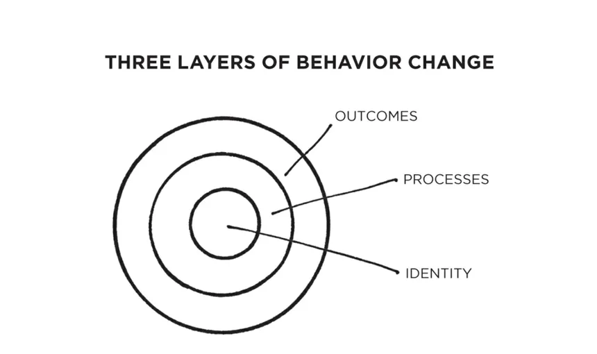
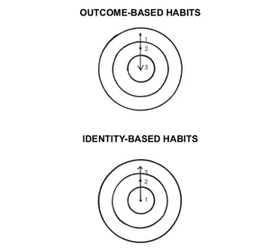

# Atomic Habits

" Tiny changes, remarkable results" Atomic Habits is a book by James Clear.

## Notes

- 1% each days makes you + 365% at the end of the year
- habits sprouts grow stronger
- plateau of latent potential is the time when you think not gaining anything from the activity
- system vs goals => how you get there is more important then the goal itself. reaching a goal is momentary, soon another goal (bigger) will be needed.
- "habits are like the atoms of our lives, each one is a fundamental  unit that contributes to your overhall improvement"
- outcome-based habits => what you want to achieve
- identity-based habits => What you want to become

- make yours and become the habit you want to have
- take the time to decompose your day and judge the positive and negatives
- link your habits in order to make them easier, healthier => ex : after my meal I launch the dishwasher and use clean the table. (3 actions back to back)